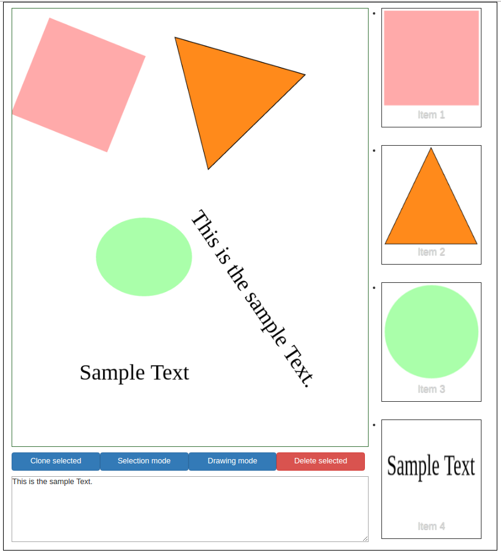

# Fabric-Drag-n-Drop



## About
This project is Drag n Drop, Clone, Resize, Rotate and Delete using Fabric.js, Javascript and JQuery.
This Fabric example is written by [Big Silver].

## Quick Start

```bash
# clone our repo
$ git clone https://github.com/Big-Silver/Fabric-Drag-n-Drop.git Fabric-Drag-n-Drop

# change directory to your app
$ cd Fabric-Drag-n-Drop

# Run the Fabric.js project.

```
